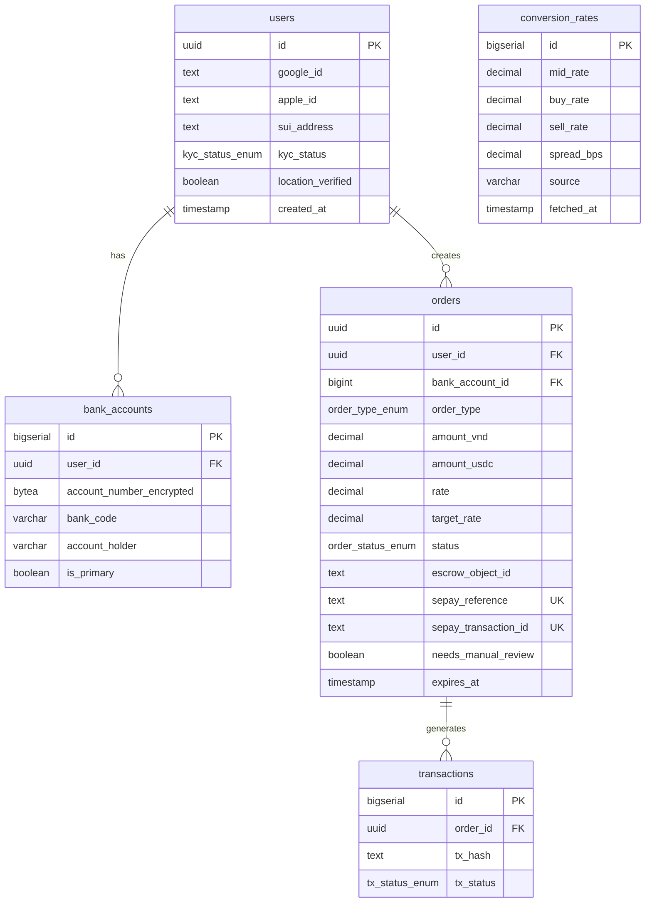
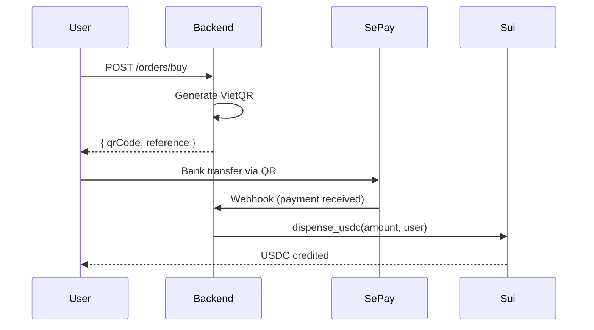
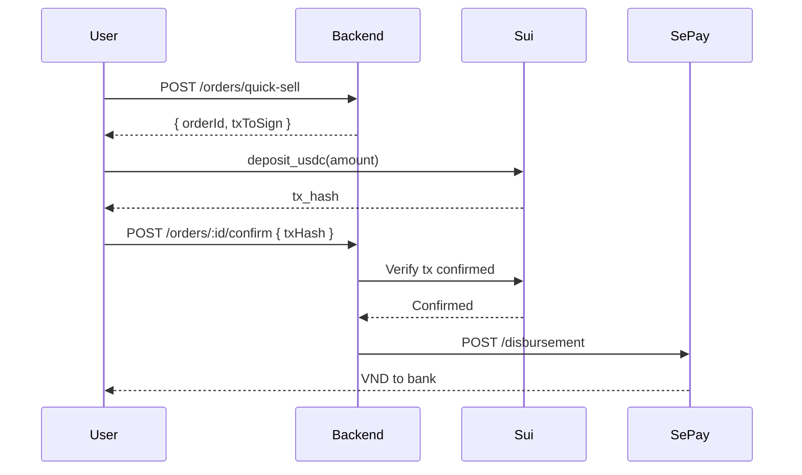
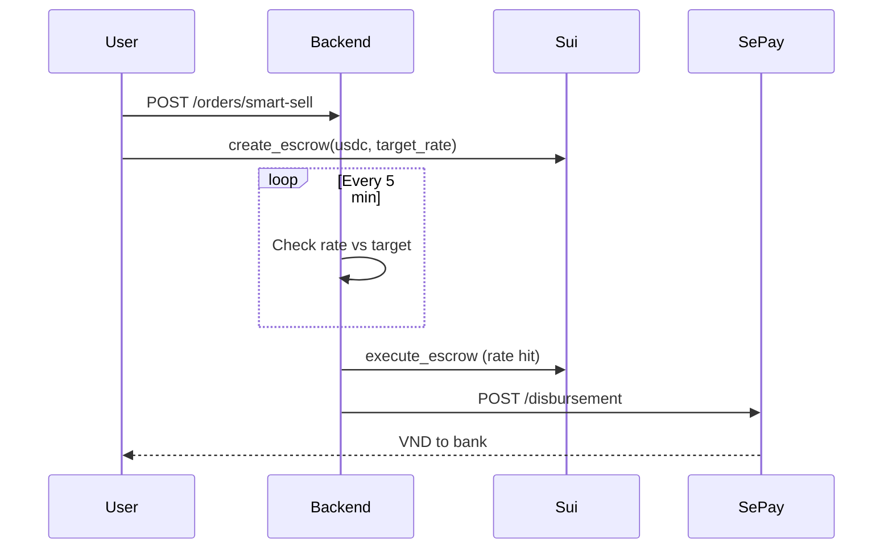

# SuiGate - System Architecture

**Version:** 1.0 | **Updated:** 2026-01-31 | **Status:** MVP Design

## Overview

3-layer architecture for VND-USDC conversion wallet on Sui Network.

```
┌─────────────────────────────────────────────────────────────────────────┐
│                         MOBILE (Expo)                                    │
│  zkLogin Auth │ Balance View │ Buy/Sell UI │ Bank Account Mgmt          │
└───────────────────────────────┬─────────────────────────────────────────┘
                                │ REST API
┌───────────────────────────────▼─────────────────────────────────────────┐
│                        BACKEND (NestJS)                                  │
│  Auth │ Orders │ Webhooks │ Jobs │ Rate Feed                            │
└─────────┬─────────────────────┬─────────────────────────────────────────┘
          │ Supabase            │ Sui RPC
┌─────────▼──────────┐  ┌───────▼─────────────────────────────────────────┐
│   DATABASE         │  │              BLOCKCHAIN (Sui)                    │
│  (PostgreSQL)      │  │  Escrow Module │ Liquidity Pool │ USDC          │
└────────────────────┘  └─────────────────────────────────────────────────┘
```

## Tech Stack

| Layer | Technology | Rationale |
|-------|------------|-----------|
| Mobile | Expo 54 + React Native 0.81.5 | Cross-platform, native modules |
| State | Zustand 5.0.10 | Lightweight, hooks-based |
| Backend | NestJS + TypeScript | Modular, type-safe, battle-tested |
| Database | Supabase (PostgreSQL) + RLS | Free tier, auth, row-level security |
| Queue | BullMQ + Redis | Reliable job scheduling, retries |
| Blockchain | Sui Network + Move | zkLogin native, fast finality |
| Payment | SePay (VietQR) | Vietnamese bank transfer |
| Price Feed | exchange-api (free) | VND/USDC mid-rate, no auth needed |
| Admin | Next.js 14 + TanStack Query | Real-time operations, analytics |

---

## Database Schema

### Entity Relationship



### ENUM Types

```sql
CREATE TYPE kyc_status_enum AS ENUM ('pending', 'approved', 'rejected');
CREATE TYPE order_type_enum AS ENUM ('buy', 'quick_sell', 'smart_sell');
CREATE TYPE order_status_enum AS ENUM ('pending', 'paid', 'processing', 'settled', 'cancelled', 'failed');
CREATE TYPE tx_status_enum AS ENUM ('pending', 'confirmed', 'failed');
```

### Key Indexes

```sql
CREATE INDEX idx_users_sui_address ON users(sui_address);
CREATE INDEX idx_orders_user ON orders(user_id);
CREATE INDEX idx_orders_status ON orders(status);
CREATE INDEX idx_orders_sepay ON orders(sepay_reference);
CREATE INDEX idx_orders_smart_sell ON orders(order_type, status)
  WHERE order_type = 'smart_sell' AND status = 'pending';
```

### RLS Policies

All tables use Row Level Security. Users can only access their own data via `auth.uid()`.

---

## API Design

### Endpoints Summary

| Method | Endpoint | Purpose | Auth |
|--------|----------|---------|------|
| POST | /auth/zklogin | zkLogin registration | No |
| GET | /users/me | Get profile + KYC status | Yes |
| PATCH | /users/me/kyc | Update KYC (mock) | Yes |
| PATCH | /users/me/location | Update location status | Yes |
| GET | /wallet/balance | Get USDC balance | Yes |
| GET | /rates/current | Get VND/USDC rate | Yes |
| POST | /orders/buy | Create buy order | Yes |
| POST | /orders/quick-sell | Create quick sell | Yes |
| POST | /orders/smart-sell | Create smart sell | Yes |
| GET | /orders | List orders | Yes |
| GET | /orders/:id | Get order detail | Yes |
| POST | /orders/:id/confirm | Confirm tx hash | Yes |
| DELETE | /orders/:id | Cancel smart sell | Yes |
| GET | /bank-accounts | List bank accounts | Yes |
| POST | /bank-accounts | Add bank account | Yes |
| DELETE | /bank-accounts/:id | Delete bank account | Yes |
| POST | /webhooks/sepay | SePay webhook | Signature |

### Key Request/Response

**POST /orders/buy**
```json
// Request
{ "amountVnd": 1000000 }

// Response
{
  "orderId": "uuid",
  "amountUsdc": "39.80",
  "rate": "25000.00",
  "qrCode": "data:image/png;base64,...",
  "reference": "SG-ABC123",
  "expiresAt": "2026-01-31T10:15:00Z"
}
```

**POST /orders/smart-sell**
```json
// Request
{ "amountUsdc": "100", "targetRate": "26000", "bankAccountId": 1 }

// Response
{
  "orderId": "uuid",
  "targetRate": "26000",
  "fee": "0.002",
  "comparison": {
    "quickSellVnd": "2487500",
    "smartSellVnd": "2594800",
    "savings": "107300"
  }
}
```

### Error Codes

`INVALID_TOKEN`, `KYC_REQUIRED`, `LOCATION_REQUIRED`, `INSUFFICIENT_BALANCE`, `INSUFFICIENT_LIQUIDITY`, `ORDER_NOT_FOUND`, `RATE_EXPIRED`, `TARGET_RATE_OUT_OF_RANGE`

---

## Smart Contracts (Move)

### Module: escrow.move

Lock USDC for Smart Sell orders.

```move
struct Escrow has key, store {
    id: UID,
    owner: address,
    usdc_balance: Coin<USDC>,
    target_rate: u64,
    bank_account_id: u64,
    created_at: u64,
}

// User functions
public entry fun create_escrow(usdc, target_rate, bank_account_id, ctx)
public entry fun cancel_escrow(escrow, ctx)

// Admin functions (reads oracle for rate validation)
public entry fun execute_escrow(admin_cap, escrow, oracle, clock, recipient, ctx) {
    let current_rate = price_oracle::get_sell_rate(oracle, clock);
    assert!(current_rate >= escrow.target_rate, E_RATE_NOT_MET);
    // ... transfer USDC
}
public entry fun partial_fill(admin_cap, escrow, fill_amount, buy_rate, recipient, ctx)
```

### Module: liquidity_pool.move

Platform-funded USDC reserve (MVP). External LP support planned for post-MVP.

```move
struct LiquidityPool has key {
    id: UID,
    usdc_reserve: Balance<USDC>,
    total_volume: u64,
    is_active: bool,
}

// Admin functions (platform only for MVP)
public entry fun add_liquidity(admin_cap, pool, usdc, ctx)
public entry fun withdraw_liquidity(admin_cap, pool, amount, recipient, ctx)

// Swap functions
public entry fun dispense_usdc(admin_cap, pool, amount, recipient, ctx)  // Buy
public entry fun deposit_usdc(pool, usdc, ctx)  // Quick Sell
```

### Module: price_oracle.move

On-chain VND/USDC rate oracle with bid/ask spread.

```move
const MAX_STALENESS_MS: u64 = 600_000; // 10 min

struct PriceOracle has key {
    id: UID,
    buy_rate: u64,          // User buys USDC at this rate (higher)
    sell_rate: u64,         // User sells USDC at this rate (lower)
    mid_rate: u64,          // Market mid-point reference
    spread_bps: u64,        // Spread in basis points (e.g., 50 = 0.5%)
    last_updated: u64,      // Timestamp ms
    source: String,
}

// Admin updates (backend fetches mid-rate, calculates spread)
public entry fun update_rates(admin, oracle, mid_rate, spread_bps, clock, ctx)

// Public read with staleness check
public fun get_buy_rate(oracle: &PriceOracle, clock: &Clock): u64 {
    assert!(clock.timestamp_ms() - oracle.last_updated < MAX_STALENESS_MS, E_STALE);
    oracle.buy_rate
}
public fun get_sell_rate(oracle: &PriceOracle, clock: &Clock): u64 {
    assert!(clock.timestamp_ms() - oracle.last_updated < MAX_STALENESS_MS, E_STALE);
    oracle.sell_rate
}
```

**Rate Calculation:**
```
mid_rate = 25,000 VND/USDC (from Binance)
spread = 0.5% (50 bps)

buy_rate  = 25,000 × 1.0025 = 25,062.50 VND  (user pays more)
sell_rate = 25,000 × 0.9975 = 24,937.50 VND  (user receives less)
```

**MVP:** On-chain oracle. Backend fetches Binance mid-rate, updates oracle every 5 min.
**Contracts read rates directly from oracle (trustless).**

### Batch PTB Optimization

**Problem:** Smart sell execution requires 3 separate transactions:
1. Update oracle with latest rate
2. Execute escrow when rate matches
3. Dispense pool liquidity to recipient

This creates inefficiency and stale oracle reads between ops.

**Solution:** Batch PTB combines all 3 into single transaction:
```
┌─ Batch Programmable Transaction Block
│  ├─ oracle::update_rates() - Fetch latest rate
│  ├─ escrow::execute_escrow() - Read fresh rate, validate, execute
│  └─ liquidity_pool::dispense_usdc() - Transfer VND recipient
└─ Single atomic operation
```

**Benefits:**
- Prevents stale oracle reads (all use same block's oracle state)
- Reduces gas by ~66% (1 tx vs 3)
- Atomic settlement (all-or-nothing)
- Backend constructs PTB, Sui Enoki signs for free

**Implementation:** `sui-transaction.service.ts` builds batch PTB for smart sell fills.

### buy_rate in partial_fill

**Context:** Smart sell orders can fill partially. Each fill must apply the current buy_rate for accurate VND calculation.

**Function Signature:**
```move
public entry fun partial_fill(
  admin_cap: &AdminCap,
  escrow: &mut Escrow,
  fill_amount: u64,
  buy_rate: u64,          // Current rate at time of fill
  recipient: address,
  ctx: &mut TxContext
)
```

**How it works:**
1. Backend fetches current buy_rate from oracle
2. Calculates VND payout: `fill_amount × buy_rate`
3. Calls partial_fill with fresh buy_rate
4. Contract applies rate in calculation
5. User receives accurate VND amount

**Example:**
- User created smart sell: 100 USDC at target 27,000 VND/USDC
- Market reaches 27,500 VND/USDC
- Backend fills 70 USDC now: `70 × 27,500 = 1,925,000 VND`
- Later fills 30 USDC at different rate

### Function Access Matrix

| Module | Function | Access |
|--------|----------|--------|
| escrow | create_escrow | Public |
| escrow | cancel_escrow | Owner |
| escrow | execute_escrow | Admin |
| escrow | partial_fill | Admin |
| liquidity_pool | add_liquidity | Admin |
| liquidity_pool | withdraw_liquidity | Admin |
| liquidity_pool | dispense_usdc | Admin |
| liquidity_pool | deposit_usdc | Public |
| price_oracle | update_price | Admin |
| price_oracle | get_rate | Public |

---

## Core Flows

### Buy USDC (VND -> USDC)



### Quick Sell (Instant)



**CRITICAL:** Backend MUST verify tx confirmed on-chain BEFORE calling disbursement.

### Smart Sell (Target Rate)



---

## Integrations

### SePay

- **VietQR**: `https://qr.sepay.vn` - Generate payment QR
- **Webhook**: `POST /webhooks/sepay` - Payment notification (~10s latency)
- **Disbursement**: `POST /disbursement` - Send VND to bank

**Webhook Verification**: HMAC-SHA256 signature in `X-Sepay-Signature` header.

### Sui RPC

```typescript
// Core methods
suiClient.getCoins({ owner, coinType: USDC_TYPE })
suiClient.executeTransactionBlock({ transactionBlock, signature })
suiClient.getLatestSuiSystemState()  // Current epoch
```

### zkLogin

1. Generate ephemeral key + nonce
2. Redirect to Google OAuth
3. Receive JWT, derive Sui address via `jwtToAddress(jwt, salt)`
4. Session valid ~10 days (10 epochs)
5. Re-login required after expiry (no silent refresh for MVP)

---

## Architecture Decisions

| Decision | Choice | Rationale |
|----------|--------|-----------|
| Liquidity Model | Platform-funded (MVP) | KISS, external LP post-MVP |
| Escrow ↔ Pool | Separate (no integration) | KISS |
| Price Oracle | On-chain (MVP) | Trustless, contracts read directly |
| Redis | Railway addon | Same platform |
| Session Expiry | Re-login | Skip refresh complexity |
| Disbursement Fail | Manual review flag | Safety |
| Bank Account PII | Encrypted (bytea) | Security |

---

## Security

### Boundaries

```
PUBLIC ZONE
├── Mobile app
└── OAuth endpoints

DMZ (API Gateway)
├── Rate limiting (50 req/min/user)
├── JWT validation
└── Webhook signature verification

PRIVATE ZONE
├── Supabase (RLS enforced)
├── Redis (internal network)
└── Sui RPC (authenticated)
```

### Data Protection

- Bank account numbers encrypted at rest
- RLS policies on all user tables
- Webhook signature verification (HMAC-SHA256)
- No plaintext PII in logs

---

## User Stories Coverage

| US | Feature | Components |
|----|---------|------------|
| US-01 | zkLogin | Mobile + Backend Auth |
| US-02 | Mock KYC | Backend + Supabase |
| US-03 | Location | Mobile GPS |
| US-04 | Balance | Mobile + Sui RPC |
| US-05 | History | Backend + Supabase |
| US-06 | Buy USDC | SePay + Backend + Sui |
| US-07 | Quick Sell | LiquidityPool + SePay |
| US-08 | Smart Sell | Escrow + SePay |
| US-09 | Navigation | Mobile UI |
| US-10 | Errors | Mobile + Backend |
| US-11 | i18n | Mobile |
| US-12 | Bank Accounts | Backend + Supabase |

---

## Admin Dashboard Architecture

**Location:** `/admin` (Next.js 14)
**Deployment:** Vercel
**Auth:** Google OAuth + zkLogin → JWT (24h) → Secure cookie

### Pages

| Page | Purpose | Features |
|------|---------|----------|
| `/dashboard/orders` | Real-time order management | Filter by status/type, approve/settle/cancel |
| `/dashboard/orders/[id]` | Order detail | View escrow state, transaction hash, manual review |
| `/dashboard/users` | User management | KYC status, location verification, volume |
| `/dashboard/analytics` | Business metrics | Charts (volume, fees, settlement success) |

### State Management

- **TanStack Query (@tanstack/react-query)**: Server state + caching
- **React Hooks**: Local component state
- **Fetcher**: Centralized API client with Bearer token auth

### API Integration

All requests include JWT in Authorization header:
```typescript
const api = async (url: string, options?: RequestInit) => {
  const response = await fetch(url, {
    ...options,
    headers: {
      'Authorization': `Bearer ${token}`,
      'Content-Type': 'application/json'
    }
  });
  return response.json();
};
```

### Charts & Visualizations

- **Recharts 3.7.0** for analytics dashboards
- Volume trends (24h, 7d, 30d)
- Settlement success rate
- Fee collection breakdown

---

## Deployment

```
Mobile: EAS Build → Expo Go (dev) / APK (demo)
Backend: Railway (NestJS + Redis)
Database: Supabase (free tier)
Contracts: Sui Testnet
```

---

## References

- [User Stories](./user-stories.md)
- [Requirements Scope](./requirements-scope.md)
- [Sui zkLogin Docs](https://docs.sui.io/concepts/cryptography/zklogin)
- [SePay API](https://sepay.vn/docs)
